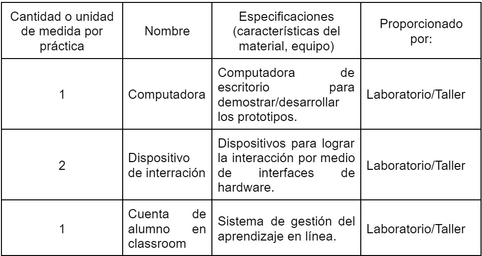

# Práctica 1. Paradigmas de interacción

> Primera Parcial

- FACULTAD DE TELEMATICA
- INGENIERÍA EN SOFTWARE
- “5ºG”
- INTERACCIÓN HUMANO-COMPUTADORA
- CATEDRATICO: RODRÍGUEZ ORTÍZ MIGUEL ÁNGEL
- COLIMA, COLIMA A 15 DE SEPTIEMBRE DE 2022

> EQUIPO 4

- AGUIRRE ROMERO RAMÓN ALEJANDRO
- BRICEÑO SÁNCHEZ FERNANDO
- GONZÁLEZ MAGAÑA GAMALIEL ADALID
- HIGUERA MAYORAL GUSTAVO
- MEZA AGUILAR KAROL MARCELINO

## Introducción a la práctica

Los estilos de interacción son las formas en que personas interactúan con las computadoras. Los paradigmas de interacción son los modelos que se derivan de los estilos de interacción y los más conocidos son:

- Interfaz por línea de comandos.
- Interfaz Gráfica de Usuario.
- Interfaz de voz.

En la actualidad existen diversos paradigmas, el estudiante conocerá su estado del arte y adquirirá las competencias al desarrollar dos pruebas de concepto.

> ENTREGA: JUEVES 15 DE SEPTIEMBRE DEL 2022

## Materiales (equipos, sustancias, aparatos, implementos)

## Desarrollo de la práctica

Dentro de la práctica se buscó la integración de dos paradigmas de la interacción en un mismo ejecutable Los paradigmas que se emplearon fueron: la interacción por consola además de la interacción por voz.
La interacción por consola fue la manera en la que se representó visualmente en el momento de ejecutar el programa, lo que se representa es una cuadricula de 3 x 3 la cual esta enumerada, lo que se pretende hacer es jugar al gato contra una inteligencia artificial llamada Monday.
El programa responde por voz por lo cual para poder elegir una casilla se debe decir “Monday, play (número del 1 - 9)” de esa manera se elegirá tu número para que posteriormente Monday elija el suyo, se seguirá un bucle hasta que ya no queden casillas por elegir o cuando un jugador gane.
Para el funcionamiento del programa se tienen dos archivos uno que ejecuta las decisiones del jugador en base a lo que escucha Monday y en el otro archivo es el funcionamiento de juego Tic Tac Toe.
Para que monday pueda entender al jugador se instalaron 3 librerías: speech_recognition, pyttsx3 y PyAudio. Lo que el usuario ocupaba decir es el numero o la casilla que quiere seleccionar luego se ejecuta el archivo de decisiones de Monday la cual revisa si alguien ha hecho tres en línea, sino entonces elige un numero que no este ocupado y le pasa el turno al jugador. Este ciclo continuo hasta que el usuario o Monday ganen o hasta que se acaben todos los números disponibles.
